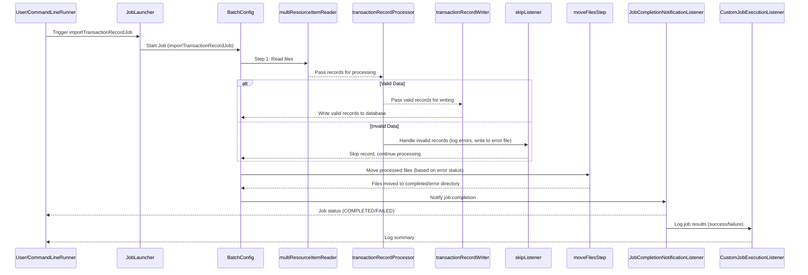

# Transaction Batch Processor

## Overview
The **Transaction Batch Processor** is a Spring Batch application designed to process transaction records from a set of input files and store the processed data into a MySQL database. The application reads transaction data from text files, processes the data, and then writes it to a MySQL database. After processing, the input files are moved to a completed folder.

## Features
- **Batch Processing**: Utilizes Spring Batch to process large volumes of transaction data efficiently.
- **Database Interaction**: Writes processed data to a MySQL database.
- **File Management**: Automatically moves processed files to a completed directory.

## Prerequisites
Before running this application, ensure you have the following installed:

- Java 17
- Maven 3.6+
- MySQL 5.7+ or 8.0+
- An IDE like IntelliJ IDEA or Eclipse (optional but recommended)

## Setting Up the MySQL Database

### Step 1: Create a MySQL Database
First, create a database in MySQL for the batch processing application. You can use the following SQL command:

```sql
CREATE DATABASE maybank_test;
-- Autogenerated: do not edit this file

CREATE TABLE BATCH_JOB_INSTANCE  (
    JOB_INSTANCE_ID BIGINT  NOT NULL PRIMARY KEY ,
    VERSION BIGINT ,
    JOB_NAME VARCHAR(100) NOT NULL,
    JOB_KEY VARCHAR(32) NOT NULL,
    constraint JOB_INST_UN unique (JOB_NAME, JOB_KEY)
) ENGINE=InnoDB;

CREATE TABLE BATCH_JOB_EXECUTION  (
    JOB_EXECUTION_ID BIGINT  NOT NULL PRIMARY KEY ,
    VERSION BIGINT  ,
    JOB_INSTANCE_ID BIGINT NOT NULL,
    CREATE_TIME DATETIME(6) NOT NULL,
    START_TIME DATETIME(6) DEFAULT NULL ,
    END_TIME DATETIME(6) DEFAULT NULL ,
    STATUS VARCHAR(10) ,
    EXIT_CODE VARCHAR(2500) ,
    EXIT_MESSAGE VARCHAR(2500) ,
    LAST_UPDATED DATETIME(6),
    constraint JOB_INST_EXEC_FK foreign key (JOB_INSTANCE_ID)
    references BATCH_JOB_INSTANCE(JOB_INSTANCE_ID)
) ENGINE=InnoDB;

CREATE TABLE BATCH_JOB_EXECUTION_PARAMS  (
    JOB_EXECUTION_ID BIGINT NOT NULL ,
    PARAMETER_NAME VARCHAR(100) NOT NULL ,
    PARAMETER_TYPE VARCHAR(100) NOT NULL ,
    PARAMETER_VALUE VARCHAR(2500) ,
    IDENTIFYING CHAR(1) NOT NULL ,
    constraint JOB_EXEC_PARAMS_FK foreign key (JOB_EXECUTION_ID)
    references BATCH_JOB_EXECUTION(JOB_EXECUTION_ID)
) ENGINE=InnoDB;

CREATE TABLE BATCH_STEP_EXECUTION  (
    STEP_EXECUTION_ID BIGINT  NOT NULL PRIMARY KEY ,
    VERSION BIGINT NOT NULL,
    STEP_NAME VARCHAR(100) NOT NULL,
    JOB_EXECUTION_ID BIGINT NOT NULL,
    CREATE_TIME DATETIME(6) NOT NULL,
    START_TIME DATETIME(6) DEFAULT NULL ,
    END_TIME DATETIME(6) DEFAULT NULL ,
    STATUS VARCHAR(10) ,
    COMMIT_COUNT BIGINT ,
    READ_COUNT BIGINT ,
    FILTER_COUNT BIGINT ,
    WRITE_COUNT BIGINT ,
    READ_SKIP_COUNT BIGINT ,
    WRITE_SKIP_COUNT BIGINT ,
    PROCESS_SKIP_COUNT BIGINT ,
    ROLLBACK_COUNT BIGINT ,
    EXIT_CODE VARCHAR(2500) ,
    EXIT_MESSAGE VARCHAR(2500) ,
    LAST_UPDATED DATETIME(6),
    constraint JOB_EXEC_STEP_FK foreign key (JOB_EXECUTION_ID)
    references BATCH_JOB_EXECUTION(JOB_EXECUTION_ID)
) ENGINE=InnoDB;

CREATE TABLE BATCH_STEP_EXECUTION_CONTEXT  (
    STEP_EXECUTION_ID BIGINT NOT NULL PRIMARY KEY,
    SHORT_CONTEXT VARCHAR(2500) NOT NULL,
    SERIALIZED_CONTEXT TEXT ,
    constraint STEP_EXEC_CTX_FK foreign key (STEP_EXECUTION_ID)
    references BATCH_STEP_EXECUTION(STEP_EXECUTION_ID)
) ENGINE=InnoDB;

CREATE TABLE BATCH_JOB_EXECUTION_CONTEXT  (
    JOB_EXECUTION_ID BIGINT NOT NULL PRIMARY KEY,
    SHORT_CONTEXT VARCHAR(2500) NOT NULL,
    SERIALIZED_CONTEXT TEXT ,
    constraint JOB_EXEC_CTX_FK foreign key (JOB_EXECUTION_ID)
    references BATCH_JOB_EXECUTION(JOB_EXECUTION_ID)
) ENGINE=InnoDB;

CREATE TABLE BATCH_STEP_EXECUTION_SEQ (
    ID BIGINT NOT NULL,
    UNIQUE_KEY CHAR(1) NOT NULL,
    constraint UNIQUE_KEY_UN unique (UNIQUE_KEY)
) ENGINE=InnoDB;

INSERT INTO BATCH_STEP_EXECUTION_SEQ (ID, UNIQUE_KEY) select * from (select 0 as ID, '0' as UNIQUE_KEY) as tmp where not exists(select * from BATCH_STEP_EXECUTION_SEQ);

CREATE TABLE BATCH_JOB_EXECUTION_SEQ (
    ID BIGINT NOT NULL,
    UNIQUE_KEY CHAR(1) NOT NULL,
    constraint UNIQUE_KEY_UN unique (UNIQUE_KEY)
) ENGINE=InnoDB;

INSERT INTO BATCH_JOB_EXECUTION_SEQ (ID, UNIQUE_KEY) select * from (select 0 as ID, '0' as UNIQUE_KEY) as tmp where not exists(select * from BATCH_JOB_EXECUTION_SEQ);

CREATE TABLE BATCH_JOB_SEQ (
    ID BIGINT NOT NULL,
    UNIQUE_KEY CHAR(1) NOT NULL,
    constraint UNIQUE_KEY_UN unique (UNIQUE_KEY)
) ENGINE=InnoDB;

INSERT INTO BATCH_JOB_SEQ (ID, UNIQUE_KEY) select * from (select 0 as ID, '0' as UNIQUE_KEY) as tmp where not exists(select * from BATCH_JOB_SEQ);
```
Run this script against your maybank_test database to create the necessary tables.

## Configuration

### Step 3: Configure the application.properties
The application uses the application.properties file to configure the database connection and other parameters. Update the following properties:

```properties
# Define the external directory paths
transaction.input.dir=C:/project/iv/maybank/Input
transaction.completed.dir=C:/project/iv/maybank/Input/Completed

# Database configuration
spring.datasource.url=jdbc:mysql://localhost:3306/maybank_test
spring.datasource.username=root
spring.datasource.password=your_password

# Other Spring configurations
spring.jpa.hibernate.ddl-auto=update
spring.datasource.driver-class-name=com.mysql.cj.jdbc.Driver

# Optionally, allow Spring Batch to create the tables
spring.batch.initialize-schema=always

# Enable Spring Batch job auto-run
spring.batch.job.enabled=true

# Set the application to run in non-web mode
spring.main.web-application-type=NONE
```
Make sure to replace your_password with your actual MySQL root password.

## Step 4: Compile and Run the Application
Use Maven to compile and run the application. In the project root directory, execute the following commands:

```maven
mvn clean install
mvn spring-boot:run
```

## Step 5: Verify the Results
After running the application, the processed transaction data should be available in the transaction_record table in your MySQL database. The input files should be moved to the Completed directory.

## Activity Diagram



# Design Patterns
## 1. Job Configuration (Builder Pattern):
- The BatchConfig class uses the Builder Pattern extensively for configuring and constructing batch jobs, steps, readers, processors, and writers. 
  - Example:
    - The JobBuilder, StepBuilder, FlatFileItemReaderBuilder, and JdbcBatchItemWriterBuilder are used to fluently construct jobs and steps.
    
## 2. Template Method Pattern:
- The Template Method Pattern is applied in the Spring Batch framework itself, where the structure of the job is defined by the framework, but specific steps (reading, processing, writing) are implemented in the BatchConfig. 
  - Example:
    - You define how records are read, processed, and written in the batch steps, while the overall execution flow is managed by the Spring Batch framework.

## 3. Strategy Pattern:
- The Strategy Pattern is applied in the way you can define multiple strategies (readers, processors, writers) for handling various types of inputs and outputs. 
  - Example:
    - The transactionRecordProcessor, multiResourceItemReader, and transactionRecordWriter are interchangeable components that can be customized based on specific processing needs.

## 4. Observer Pattern:
- The Observer Pattern is used with listeners like JobCompletionNotificationListener and CustomJobExecutionListener, which observe the state of the job execution and act upon its completion or failure. 
  - Example:
    - These listeners are notified when the job is completed, and they log the outcome or perform additional tasks.

## 5. Decorator Pattern:
- The Decorator Pattern is seen in the way fault-tolerant mechanisms like skip and retry are added to the job steps without altering the core processing logic. 
  - Example:
    - The faultTolerant() method in StepBuilder decorates the existing step with fault tolerance capabilities, allowing for error handling like skipping or retrying failed records.